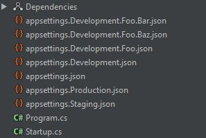
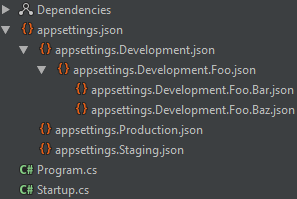

# AppSettings

[](https://ci.appveyor.com/project/Chakrygin/appsettings/branch/master)
[](https://www.nuget.org/packages/AppSettings.DependentUpon/)

## AppSettings.DependentUpon

Automatically nests an appsettings files in JetBrains Rider.

```
Install-Package AppSettings.DependentUpon
```

| Before                       | After                       |
| ---------------------------- | --------------------------- |
|  |  |
